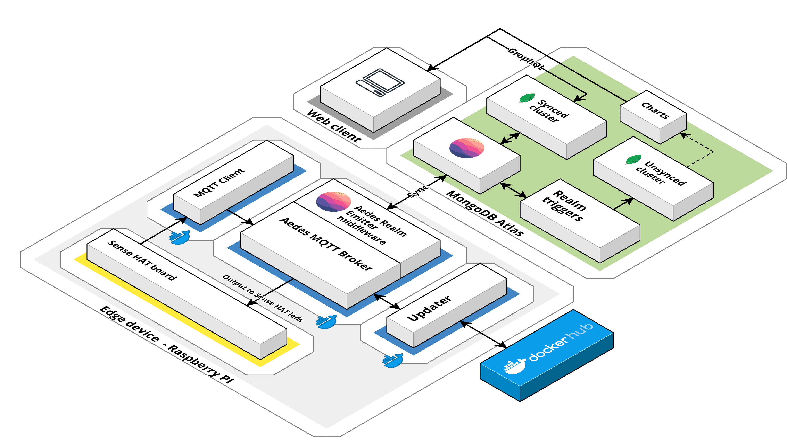
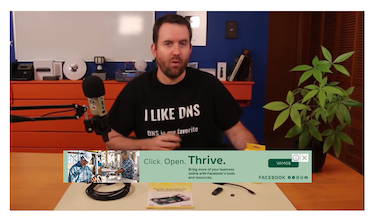
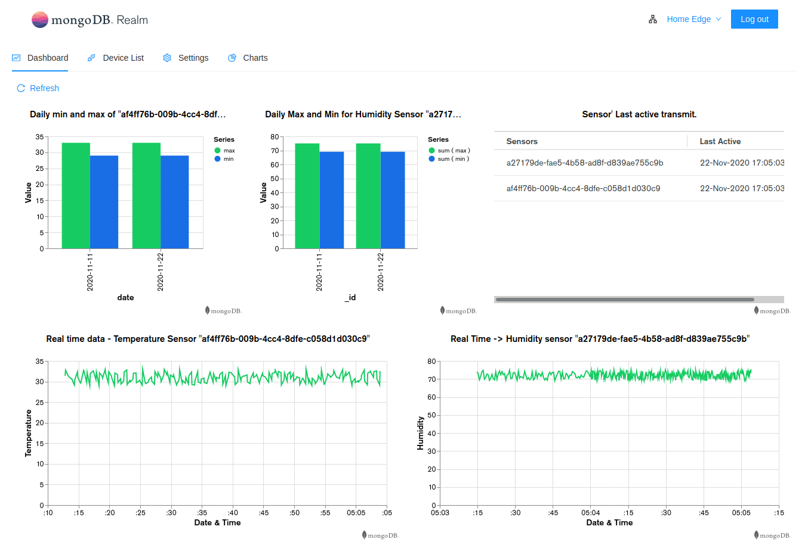
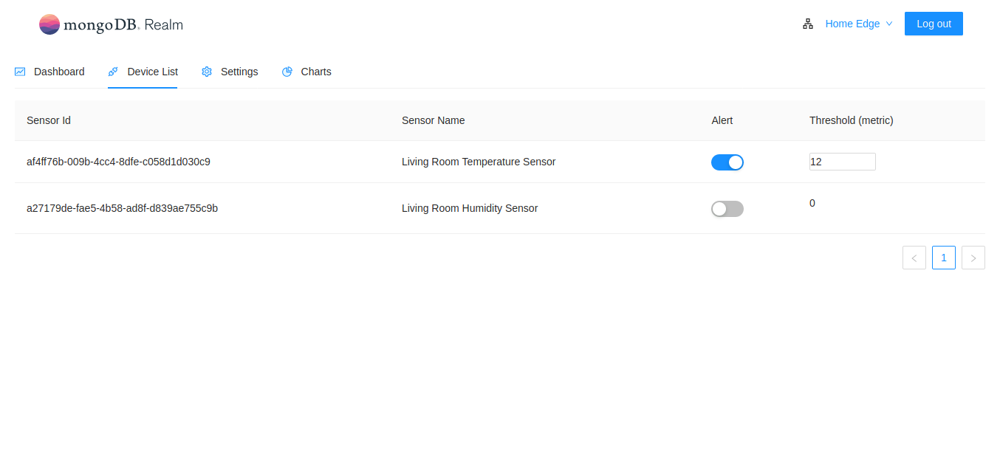
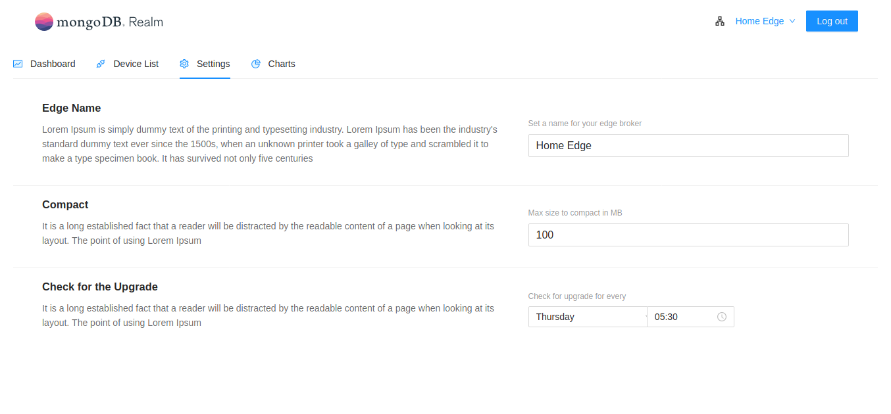

# Realm IOT

## Overview

A reference application to showcase MongoDB's Realm Sync on a Raspberry PI device. The app itself has a few services

- An MQTT broker, running on the RPI, built using aedes. A custom emitter middleware handles the sync with Realm. Runs on the Raspberry PI.
- Multiple MQTT clients reading in data from temperature & humidity sensors, that sends observations to the broker at configured intervals
- An updater service, running on the RPI, that pulls in images from Dockerhub to update the broker container.
- A dashboard to displays charts created on Atlas and configure the broker on the edge.

## Architecture



## Getting Started

### Hardware

You will need a Raspberry PI and a Sense HAT addon board to get started. We've gone with the RPI 4 Model B 4gb but a RPI 3 Model B/B+ should work fine as well.

Amazon links to a good RPI starter kit and the Sense HAT board are listed below.

- [CanaKit Raspberry Pi 4 4GB Starter PRO Kit - 4GB RAM](https://www.amazon.com/CanaKit-Raspberry-4GB-Starter-Kit/dp/B07V5JTMV9/)
- [Sense HAT](https://www.amazon.com/RASPBERRY-PI-RASPBERRYPI-SENSEHAT-Raspberry-Orientation-Temperature/dp/B014HDG74S/)

The below video is a good introduction to the RPI

[](https://www.youtube.com/watch?v=BpJCAafw2qE&feature=youtu.be)

_The Sense HAT plugs in easily on the RPI board but we've found that the sensor data can be easily affected by the RPI's CPU temp. If this is a concern, a simple fix would be to use a ribbon cable to move the sensor away from the CPU._

### Software

Our setup uses Raspberry PI OS. We used the Raspberry PI Imager to format and get the SD card ready. You can find detailed instructions on using the imager here <https://projects.raspberrypi.org/en/projects/raspberry-pi-getting-started/1>

With the OS installed, the next step would be to install Docker. Open up a terminal on your Raspberry PI and run the below commands

```shell
sudo apt-get update && sudo apt-get upgrade
curl -fsSL https://get.docker.com -o get-docker.sh
sudo sh get-docker.sh
```

Add a non-root user to the Docker group

```shell
sudo usermod -aG docker pi
```

#### MongoDB setup

With docker installed, we need to setup our Realm app on atlas before starting up the services.

- First, we need to setup a cluster on MongoDB Atlas
- [Create a Realm App on Atlas](https://docs.mongodb.com/realm/get-started/create-realm-app) and link it to the cluster
- [Create a user to access the Realm](https://docs.mongodb.com/realm/users/create)
- Setup schemas for the collections we wish to sync
- Configure Realm Sync with an optional partition key
- (Optional) If you run into issues with Dashboard GraphQL queries, you may need to turn off strict validation under the GraphQL settings.

To make it a little simpler, we've included the configuration files of our Realm app. You can find these inside the folder realm-app-configuration. You can [import this configuration through the Realm CLI to setup a new Realm app](https://docs.mongodb.com/realm/deploy/realm-cli-reference#import-an-application)

#### Building docker images for the RPI

Now that the Realm app is setup and configured, you can start building out the images to deploy to the RPI.

Docker's new buildx is used to build the images. The newer versions of docker (19.03+) have buildx bundled together but you may need to enable it to actually build images. [this](https://docs.docker.com/buildx/working-with-buildx/) shows you how to enable buildx.

The next step is to setup [qemu-user-static](https://github.com/multiarch/qemu-user-static).

```shell
docker run --rm --privileged multiarch/qemu-user-static --reset -p yes
```

This lets you build arm images on your system.

The docker build scripts found under each service lets you quickly build the image and push it to Dockerhub. You'll need to login with your Dockerhub credentials before you can push the images. These scripts also take in a tag for the image as an input

```shell
./docker-build-armv7.sh v0.1.2-armv7
```

#### Setting up the containers on the RPI

Once the images are up on Dockerhub, you can get started on setting up the services on the edge. The service have a few configurable parameters than need to be passed in as environment variables to the container. In particualr, the Realm app information needs to be updated in broker.env and updater.env found under ./setup/configuration

```ini
# Realm app info
REALM_APP_ID=
REALM_EMAIL=
REALM_PASSWORD=
```

These .env files also have a few additional configurable parameters you can tweak as needed.

You can now spin up the services using the below scripts.

```shell
./1-docker-setup-network
./2-docker-setup-updater v0.1.0-armv7
./3-docker-setup-broker v0.1.2-armv7
./4-docker-setup-sensehat-client v0.1.0-armv7
```

All but the setup network script take in tags as arguments. These are used to pull in specific images from Dockerhub.

#### Getting data from Sense HAT

I will summarize the following code of sensehat:

```js
'use strict';

const nodeimu = require('nodeimu');
const mqtt = require('mqtt');

const imu = new nodeimu.IMU();
const client = mqtt.connect('mqtt://localhost:9000');

client.on('connect', () => {
  client.subscribe('dht/temperature');
  client.subscribe('dht/humidity');

  setInterval(() => {
    imu.getvalue((error, data) => {
      if (error) {
        console.log(error);
        return;
      }

      if (data.temperature) {
        client.publish(
          'dht/temperature',
          JSON.stringify({
            sensorType: 'temperature',
            sensorId: 'sensor_1',
            tempCelsius: data.temperature,
            tempFahrenheit: data.temperature * 1.8 + 32,
            timestamp: Date.now(),
          })
        );
      }

      if (data.humidity) {
        client.publish(
          'dht/humidity',
          JSON.stringify({
            sensorType: 'humidity',
            sensorId: 'sensor_1',
            relHumidity: data.humidity,
            timestamp: Date.now(),
          })
        );
      }
    });
  }, 5000);
});

client.on('message', function (topic, message) {
  console.log(new Date().toTimeString(), message.toString());
});
```

## Send IOT Data to Atlas

The [Aedes MQTT](https://github.com/moscajs/aedes) broker is configured with Realm Middleware with following option,

An configuration object is provided to the realm middleware.

You can find the schema for the different synced collections at ./broker/src/models/

Realm middleware is configured to listen the incoming payload and the message is passed to a callback registered by the broker. The handler checks thresholds, triggers alerts to Sense HAT and transforms the message payload to fit the provided schema. This transformed payload is returned to the middleware which saves it to Realm.

## Realm Triggers & Functions

Over a period of time, the data in the synced collection grows and lands up consuming space on the Edge as well. To reduce the size and also ensure data is stored appropriately for analytics for insights, we use Realm DB Triggers & functions.

With help of Realm DB triggers & functions, the realtime sensor data is moved from the synced collection to an unsyced collection an stored using a sized based bucketing pattern (Refer - <https://www.mongodb.com/blog/post/time-series-data-and-mongodb-part-1-introduction)>.

The code as follows,

```js
exports = async function () {
  const asyncForEach = async (array, callback) => {
    for (let index = 0; index < array.length; index++) {
      await callback(array[index], index, array);
    }
  };

  // Access a mongodb service:
  const mongodb = context.services.get('mongo-atlas');
  const syncCollection = mongodb.db('iot-dev').collection('sensorData');
  const nonSyncCollection = mongodb.db('iot-dev').collection('sizedSensorData');
  syncCollection
    .find({})
    .sort({ timestamp: 1 })
    .limit(100)
    .toArray()
    .then(async (items) => {
      await asyncForEach(items, async (doc, index) => {
        await nonSyncCollection.updateOne(
          {
            edgeId: doc.edgeId,
            sensorId: doc.sensorId,
            count: { $lt: 200 },
          },
          {
            $push: {
              history: { value: doc.value, timestamp: doc.timestamp },
            },
            $min: { fromTimestamp: doc.timestamp },
            $max: { toTimestamp: doc.timestamp },
            $inc: { count: 1 },
          },
          { upsert: true }
        );
        await syncCollection.deleteOne({ _id: doc._id });
      });
    })
    .catch((err) => console.error(`Failed to find documents: ${err}`));
};
```

Once the data is moved to the unsynced collection, the data is cleared from the Realm synced collection which then syncs back with the Edge realm to free up space.

## MongoDB Charts

The MongoDB Charts use the the bucketed time-series data to visualize the sensor data.



## Sensor's configuration on dashboard

The dashboard consumes the Realm GraphQL API to list all the edges and sensor's connected to the edges.

The dashboard also lets you configure the warning/alert threshold for sensors connected to the edges.



An alert is displayed on the Sense HAT led matrix if the incoming sensor data goes beyond this configured threshold value.

Email alerts are also setup using Realm triggers on Atlas. When data syncs to the cloud, the email notifications are triggered.

## Realm Compact configuration

The dashboard has the option to specify the max filesize for the Realm DB to grow on the Edge before we compact and free up the space. A schedule logic on the middleware checks the filesize and compacts when needed to save the edge running out of disk space.


